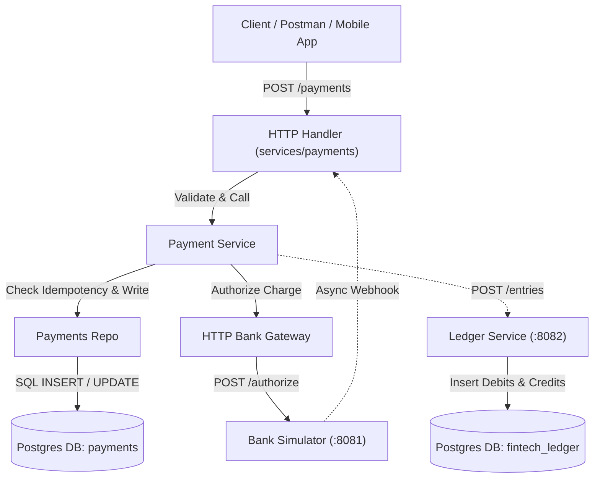

# fintech-lab

A hands-on lab for understanding how banks/fintechs engineer their core
backend systems, one module at a time. See docs/decisions for the reasoning
behind key architecture choices as they come up.

## Architecture Overview



## Modules Progress

- [x] **Module 1 — Payments Service & Bank Simulator** (Port `:8080` & `:8081`)
- [ ] **Module 2 — Ledger Service (Double-Entry Bookkeeping)** (Port `:8082`)
- [ ] **Module 3 — Transfers & Sagas**
- [ ] **Module 4 — Settlement & Reconciliation**
- [ ] **Module 5 — Notifications & Webhooks**
- [ ] **Module 6 — Fraud & Risk Engine**
- [ ] **Module 7 — Scaling, Observability & Caching**

## Continuous Integration (CI/CD)

Our automated GitHub Actions workflow (`.github/workflows/ci.yml`) runs quality checks on every push or pull request:


1. **Git Push / Pull Request** ➡️ Triggers workflow.
2. **Checkout Code** ➡️ Downloads repository code.
3. **Set up Go 1.22** ➡️ Configures Go compiler.
4. **Download Dependencies** ➡️ Downloads Go packages (`go mod download`).
5. **Run Go Unit Tests** ➡️ Executes unit tests (`go test -v ./...`).
6. **Build Binaries** ➡️ Compiles service binaries (`go build`).

### Prerequisites

- Go 1.22+ installed locally
- Docker + Docker Compose installed

### Running the infra (Postgres + RabbitMQ)

From the repo root:

```
docker compose up -d
```

Check both containers are healthy:

```
docker compose ps
```

You should see `fintech-postgres` and `fintech-rabbitmq` both listed as
"healthy" (not just "running" — healthy means the service inside actually
responded to a real check).

RabbitMQ's web dashboard: http://localhost:15672 (user: guest / pass: guest)

### Running the payments service

```
cd services/payments
go mod tidy
go run ./cmd/api
```

`go mod tidy` will download the Postgres driver dependency (jackc/pgx) and
create/update a go.sum file — this is Go's equivalent of a lockfile, pinning
exact dependency versions.

### Verifying it works

```
curl http://localhost:8080/health
```

Expected response once Postgres is up:

```json
{"status":"ok","database":"ok"}
```

If you get `"database":"unreachable: ..."` — check that
`docker compose ps` shows postgres as healthy, and that nothing else on
your machine is already using port 5432.

## Repo layout

```
fintech-lab/
├── services/
│   └── payments/        # Module 1 — first microservice
├── infra/                # future: prometheus/grafana configs (Module 7)
├── docs/decisions/       # ADRs — one file per major architecture decision
└── docker-compose.yml    # local infra: Postgres, RabbitMQ
```

Each future module (ledger, transfers, settlement, notifications, fraud)
gets its own folder under services/, its own database, and communicates
with other services only via APIs or RabbitMQ events — never by directly
touching another service's database tables.
