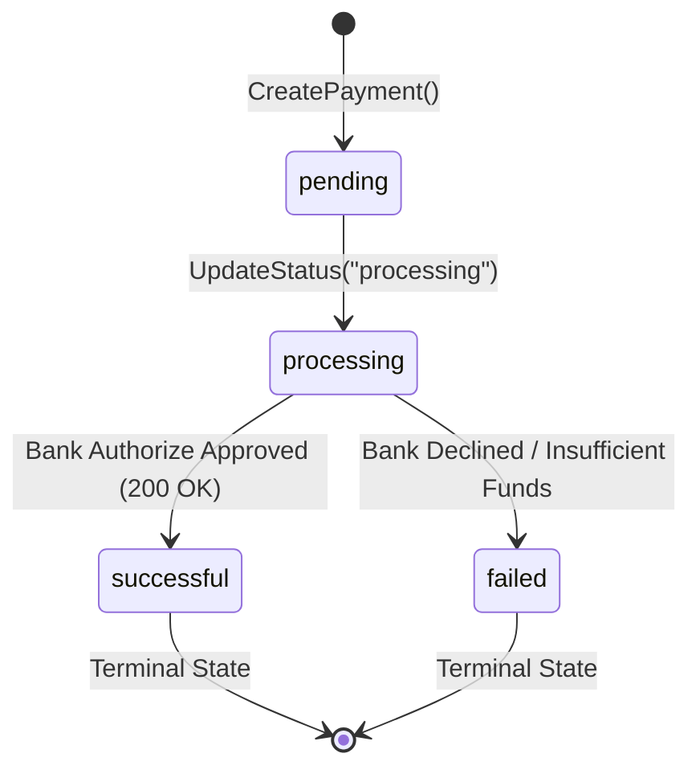

# 0001 — Payment State Machine and Mock Gateway

## Status
Accepted

## Context
When a payment request is initiated, storing it directly as a completed record without state transitions makes it impossible to represent async bank authorizations or failure modes. We need a defined state machine lifecycle and an interface to simulate external bank processing.

## Decision
We model payment states explicitly in Go as `pending` -> `processing` -> `successful` / `failed`. We introduce a `BankGateway` interface with a `MockBankGateway` implementation to simulate bank authorization responses before updating the payment status in PostgreSQL.

## Alternatives considered
- Direct synchronous success without state transitions — rejected because it ignores real-world network and bank failure states.
- Immediate DB enum constraints — rejected per project rules to keep database schemas flexible while Go business logic evolves.

## State Machine Diagram

## Consequences
- Every payment is recorded first with `status = "pending"` to guarantee idempotency.
- The payment service explicitly updates status to terminal states (`successful` or `failed`).
- Prepares the service for future integration with asynchronous events, webhooks, and the double-entry Ledger service.
