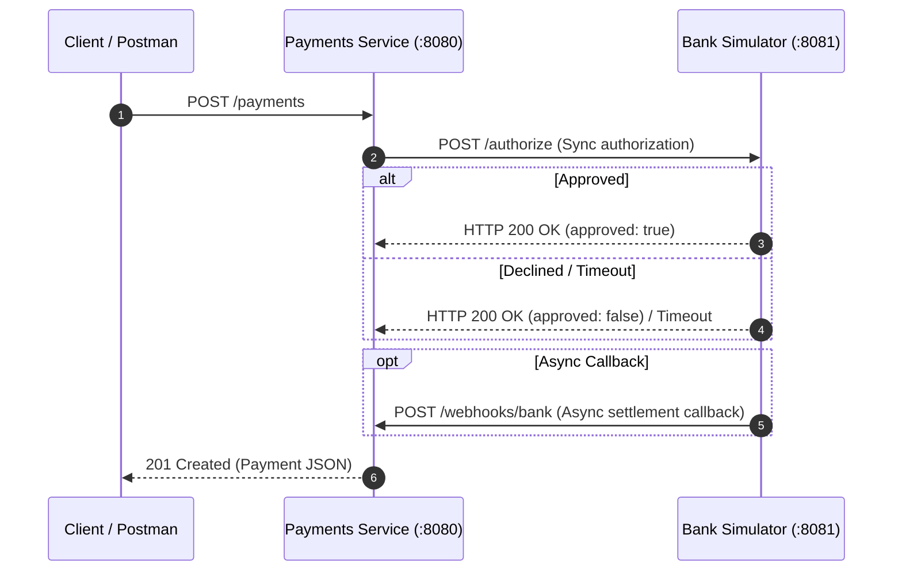

# 0002 — Bank Simulator Microservice and Webhooks Integration

## Status
Accepted

## Context
Relying solely on an in-memory mock inside the payments service prevents us from testing real-world network failure modes (server down, connection timeouts, retries) and asynchronous webhook callbacks. We need a separate microservice to simulate a bank/card network over real HTTP ports.

## Decision
We create a standalone microservice `services/bank-simulator` listening on port `:8081`. The `payments` service connects to it via an `HTTPBankGateway` with configurable timeouts and retries (3 attempts). The simulator asynchronously dispatches HTTP webhook callbacks (`POST /webhooks/bank`) back to the payments service.

## Alternatives considered
- In-memory mock only — rejected because it misses real network boundaries and socket connection failures.
- Direct external sandbox (e.g. Paystack) — deferred until internet dependency and API keys are needed.

## Network & Webhook Flow Diagram

## Consequences
- Requires running two separate microservices locally (`payments` on `:8080`, `bank-simulator` on `:8081`).
- Enables testing offline/server-down resilience (e.g., stopping `bank-simulator` and verifying retries).
- Teaches asynchronous webhook handling and state machine updates via external event callbacks.
