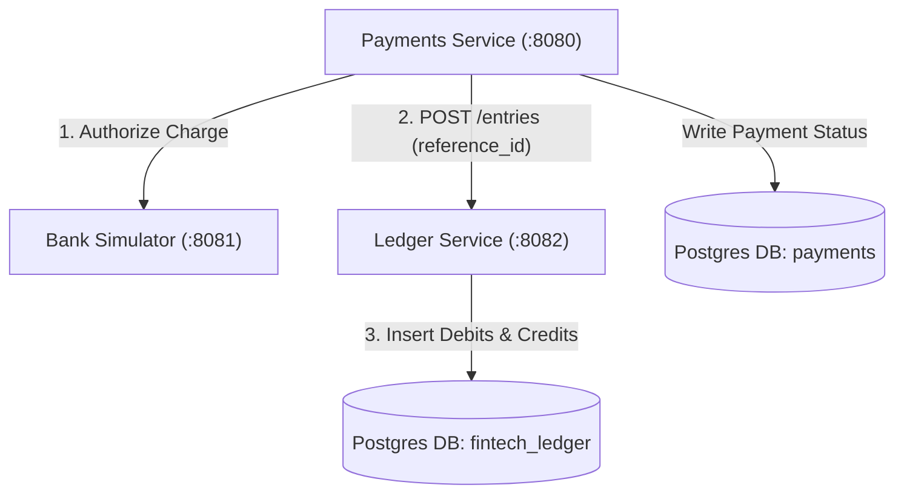

# 0003 — Standalone Ledger Service for Double-Entry Bookkeeping

## Status
Accepted

## Context
Payment processing systems require an absolute financial source of truth to record money movement across multiple transaction types (card payments, payouts, refunds, fee deductions). We needed to decide whether to embed ledger tables directly inside the Payments Service database or build a standalone Ledger microservice.

## Decision
We chose to build a **standalone Ledger microservice** running on port `:8082` with its own isolated PostgreSQL database (`fintech_ledger`), communicating with Payments and other services strictly via HTTP APIs (`POST /entries`). The Ledger enforces **Double-Entry Bookkeeping** (`Sum(Debits) == Sum(Credits)`) and **Immutable Journal Entries** (no `UPDATE` or `DELETE` operations allowed).

## Alternatives considered
- **Embedding Ledger tables inside Payments database** — Rejected because future services (Transfers, Payouts, Refunds, Fee Billing) would be forced to touch Payments database tables directly, violating microservice boundaries and coupling domain logic.
- **Single-Entry Accounting (Simple balance column on user rows)** — Rejected because single-entry balance mutation creates race conditions, lacks auditability, and cannot guarantee that money isn't created or destroyed during network failures.

## System Architecture Diagram

## Consequences
- **Easier**: All financial transactions across all services have a single, immutable, auditable accounting source of truth.
- **Harder**: Requires an extra HTTP network call from Payments to Ledger to record entries upon successful payment authorization.
- **Deferred**: Asynchronous ledger posting via RabbitMQ event bus is deferred to Module 5 (Notifications & Pub/Sub).
