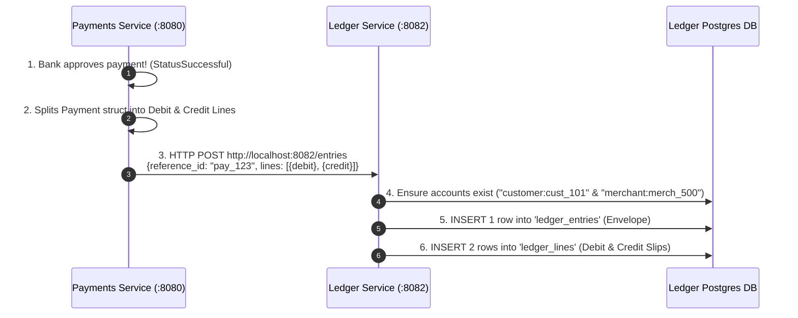

# Module 02 — Ledger Service & Double-Entry Bookkeeping

## Engineering Problem Answered
How to build an immutable, double-entry financial ledger (`Sum(Debits) == Sum(Credits)`) that records all money movement across microservices using atomic PostgreSQL transactions (`db.BeginTx`).

## Architecture & System Design

The Payments Service communicates with the Ledger Service over HTTP POST to turn payment events into double-entry accounting records.

## Key Code Entry Points & File Map

1. **[ledger.go](file:///c:/Users/USER/Downloads/fintech-lab-scaffold/services/ledger/internal/ledger.go)** — Domain Models & Structs
   - Defines `Account` (`ID`, `Type`, `Currency`), `LedgerEntry` (`ID`, `ReferenceID`), and `LedgerLine` (`ID`, `EntryID`, `AccountID`, `Amount`, `Direction`).

2. **[0001_init_ledger.sql](file:///c:/Users/USER/Downloads/fintech-lab-scaffold/services/ledger/migrations/0001_init_ledger.sql)** — PostgreSQL Schema
   - Tables: `accounts`, `ledger_entries`, and `ledger_lines` (with `CHECK` constraint for `'debit'`/`'credit'`).

3. **[repository.go](file:///c:/Users/USER/Downloads/fintech-lab-scaffold/services/ledger/internal/repository.go)** — Postgres Persistence & Atomic Transactions
   - `CreateAccount` & `GetAccount`: Manages account identity directory (`ON CONFLICT DO NOTHING`).
   - `GetLedgerLines`: Multi-row query using `r.db.QueryContext` and `for rows.Next()` loop.
   - `CreateEntryWithLines`: Atomically inserts `ledger_entries` envelope and all `ledger_lines` slips inside a single `r.db.BeginTx` SQL transaction.

4. **[main.go](file:///c:/Users/USER/Downloads/fintech-lab-scaffold/services/ledger/cmd/api/main.go)** — Microservice Wiring & Health Check
   - Runs on port `:8082`, connects to `fintech_ledger` DB, and exposes `GET /health` with `db.PingContext`.

## What Clicked Building This
- Double-entry bookkeeping guarantees money is never created or destroyed out of thin air (`Sum(Debits) == Sum(Credits)`).
- Atomic SQL transactions (`db.BeginTx` + `tx.Commit`) prevent half-written data if a server crashes mid-request.
- Microservices maintain separate database schemas (`payments` DB vs `ledger` DB) and communicate strictly via HTTP APIs.
